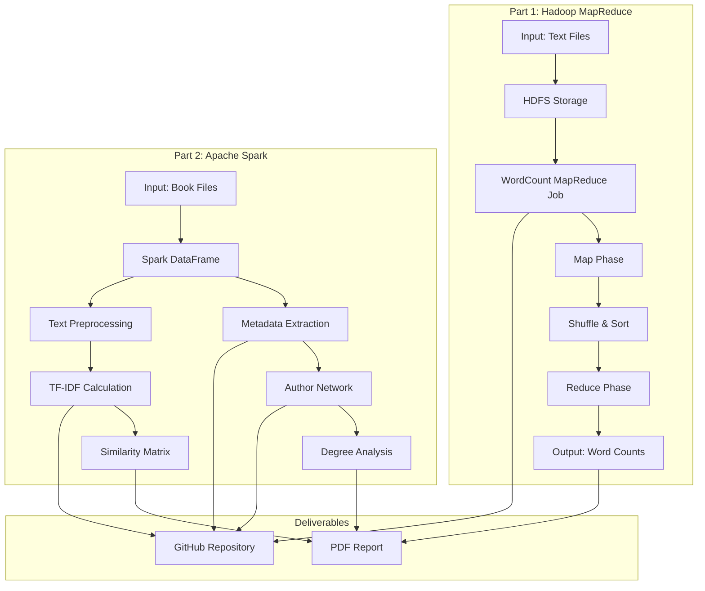

# Design Document

## Overview

This design document outlines the technical implementation for the CSL7110 Big Data Frameworks assignment. The solution is organized into two main components:

1. **Hadoop MapReduce Module (Java)**: Implements WordCount with analysis of MapReduce phases, HDFS concepts, and performance tuning
2. **Apache Spark Module (Python/PySpark)**: Implements metadata extraction, TF-IDF similarity, and author influence network analysis

The implementation prioritizes correctness, clear documentation, and educational value to demonstrate understanding of distributed computing concepts.

## Architecture



## Components and Interfaces

### Component 1: Hadoop MapReduce WordCount (Java)

```
hadoop-mapreduce/
├── src/
│   └── main/
│       └── java/
│           └── wordcount/
│               └── WordCount.java
├── input/
│   └── 200.txt
├── output/
│   └── (generated output)
└── pom.xml (or build script)
```

**WordCount.java Structure:**

```java
public class WordCount {
    
    public static class TokenizerMapper 
        extends Mapper<LongWritable, Text, Text, IntWritable> {
        
        private final static IntWritable one = new IntWritable(1);
        private Text word = new Text();
        
        public void map(LongWritable key, Text value, Context context)
            throws IOException, InterruptedException {
            // Input: (byte_offset, line_text)
            // Output: (word, 1) for each word
        }
    }
    
    public static class IntSumReducer 
        extends Reducer<Text, IntWritable, Text, IntWritable> {
        
        private IntWritable result = new IntWritable();
        
        public void reduce(Text key, Iterable<IntWritable> values, Context context)
            throws IOException, InterruptedException {
            // Input: (word, [1, 1, 1, ...])
            // Output: (word, total_count)
        }
    }
    
    public static void main(String[] args) throws Exception {
        // Job configuration and execution
    }
}
```

### Component 2: PySpark Analysis Module (Python)

```
pyspark-analysis/
├── src/
│   ├── metadata_extraction.py
│   ├── tfidf_similarity.py
│   └── author_network.py
├── utils/
│   ├── text_preprocessing.py
│   └── regex_patterns.py
├── data/
│   └── (book files)
└── requirements.txt
```

**Module Interfaces:**

```python
# metadata_extraction.py
class MetadataExtractor:
    def extract_title(text: str) -> Optional[str]
    def extract_release_date(text: str) -> Optional[str]
    def extract_language(text: str) -> Optional[str]
    def extract_encoding(text: str) -> Optional[str]
    def extract_all(df: DataFrame) -> DataFrame

# tfidf_similarity.py
class TFIDFCalculator:
    def preprocess_text(text: str) -> List[str]
    def calculate_tf(tokens: List[str]) -> Dict[str, float]
    def calculate_idf(corpus: List[List[str]]) -> Dict[str, float]
    def calculate_tfidf(df: DataFrame) -> DataFrame
    def cosine_similarity(vec1: SparseVector, vec2: SparseVector) -> float
    def find_similar_books(book_id: str, top_n: int) -> List[Tuple[str, float]]

# author_network.py
class AuthorNetworkBuilder:
    def extract_author(text: str) -> Optional[str]
    def build_edges(df: DataFrame, time_window: int) -> DataFrame
    def calculate_degrees(edges_df: DataFrame) -> DataFrame
    def top_authors_by_degree(degrees_df: DataFrame, n: int) -> DataFrame
```

## Data Models

### MapReduce Data Types

| Phase | Input Key | Input Value | Output Key | Output Value |
|-------|-----------|-------------|------------|--------------|
| Map | LongWritable (byte offset) | Text (line content) | Text (word) | IntWritable (1) |
| Reduce | Text (word) | Iterable<IntWritable> ([1,1,...]) | Text (word) | IntWritable (count) |

### Spark DataFrame Schemas

**Books DataFrame:**
```
books_df: DataFrame
├── file_name: StringType
└── text: StringType
```

**Metadata DataFrame:**
```
metadata_df: DataFrame
├── file_name: StringType
├── title: StringType (nullable)
├── release_date: StringType (nullable)
├── language: StringType (nullable)
└── encoding: StringType (nullable)
```

**TF-IDF DataFrame:**
```
tfidf_df: DataFrame
├── file_name: StringType
├── tokens: ArrayType(StringType)
└── tfidf_vector: VectorType (sparse)
```

**Author Network Edge DataFrame:**
```
edges_df: DataFrame
├── author1: StringType (earlier author)
└── author2: StringType (later author)
```

**Degree DataFrame:**
```
degrees_df: DataFrame
├── author: StringType
├── in_degree: IntegerType
└── out_degree: IntegerType
```

### Regex Patterns for Metadata Extraction

```python
PATTERNS = {
    'title': r'Title:\s*(.+?)(?:\r?\n|$)',
    'release_date': r'Release Date:\s*(.+?)(?:\r?\n|$)',
    'language': r'Language:\s*(.+?)(?:\r?\n|$)',
    'encoding': r'Character set encoding:\s*(.+?)(?:\r?\n|$)',
    'author': r'Author:\s*(.+?)(?:\r?\n|$)',
    'header_end': r'\*\*\*\s*START OF (?:THE|THIS) PROJECT GUTENBERG',
    'footer_start': r'\*\*\*\s*END OF (?:THE|THIS) PROJECT GUTENBERG'
}
```


## Algorithm Details

### WordCount Map Function

```java
public void map(LongWritable key, Text value, Context context) {
    // 1. Get line as string
    String line = value.toString();
    
    // 2. Remove punctuation: replace non-alphanumeric (except spaces) with empty
    String cleanLine = line.replaceAll("[^a-zA-Z\\s]", "");
    
    // 3. Convert to lowercase
    cleanLine = cleanLine.toLowerCase();
    
    // 4. Tokenize using StringTokenizer
    StringTokenizer tokenizer = new StringTokenizer(cleanLine);
    
    // 5. Emit (word, 1) for each token
    while (tokenizer.hasMoreTokens()) {
        word.set(tokenizer.nextToken());
        context.write(word, one);
    }
}
```

### WordCount Reduce Function

```java
public void reduce(Text key, Iterable<IntWritable> values, Context context) {
    int sum = 0;
    for (IntWritable val : values) {
        sum += val.get();
    }
    result.set(sum);
    context.write(key, result);
}
```

### TF-IDF Calculation

**Term Frequency (TF):**
```
TF(t, d) = (Number of times term t appears in document d) / (Total terms in document d)
```

**Inverse Document Frequency (IDF):**
```
IDF(t) = log(Total number of documents / Number of documents containing term t)
```

**TF-IDF Score:**
```
TF-IDF(t, d) = TF(t, d) × IDF(t)
```

### Cosine Similarity

```
cosine_similarity(A, B) = (A · B) / (||A|| × ||B||)

where:
- A · B = Σ(Ai × Bi) for all dimensions i
- ||A|| = √(Σ(Ai²)) for all dimensions i
```

### Author Influence Network Construction

```
For each pair of authors (a1, a2):
    If |release_year(a1) - release_year(a2)| <= time_window:
        If release_year(a1) < release_year(a2):
            Add directed edge: a1 → a2
        Else if release_year(a1) > release_year(a2):
            Add directed edge: a2 → a1
```

### Degree Calculations

```
in_degree(author) = count of edges where author is the target (influenced by others)
out_degree(author) = count of edges where author is the source (influences others)
```

## HDFS Concepts (Problem 8)

### Why Directories Don't Have Replication Factor

- HDFS stores data in **blocks** (default 128MB)
- Only **files** are split into blocks and replicated
- **Directories** are metadata entries in the NameNode
- Directories contain pointers to files, not actual data
- Replication applies to data blocks, not metadata

### Replication Factor Impact on Performance

**Read Performance:**
- Higher replication = more replicas to read from
- Enables parallel reads from different DataNodes
- Improves read throughput and reduces latency
- Better locality optimization (read from nearest replica)

**Write Performance:**
- Higher replication = more copies to write
- Increases write latency (must write to multiple nodes)
- Increases network bandwidth usage
- Pipeline replication mitigates some overhead

### Split Size and Mapper Count (Problem 9)

```
Number of Mappers ≈ Total Input Size / Split Size

Example with 200MB file:
- Split size 64MB → ~4 mappers
- Split size 32MB → ~7 mappers
- Split size 128MB → ~2 mappers
```

**Trade-offs:**
- Smaller splits = more parallelism, more overhead
- Larger splits = less parallelism, less overhead
- Optimal depends on cluster size and data characteristics


## Correctness Properties

*A property is a characteristic or behavior that should hold true across all valid executions of a system—essentially, a formal statement about what the system should do. Properties serve as the bridge between human-readable specifications and machine-verifiable correctness guarantees.*

### Property 1: Map Function Text Processing

*For any* input text string, the map function should:
- Remove all punctuation characters
- Convert all characters to lowercase
- Emit each word with count value of exactly 1

**Validates: Requirements 6.1, 6.2, 6.3, 6.4**

### Property 2: Reduce Function Summation

*For any* word key and iterable of IntWritable values, the reduce function should emit the word with a count equal to the sum of all input values.

**Validates: Requirements 7.1**

### Property 3: Metadata Extraction Completeness

*For any* book text containing standard Project Gutenberg header fields (Title, Release Date, Language, Encoding), the extractor should correctly parse and return each present field's value.

**Validates: Requirements 12.1, 12.2, 12.3, 12.4**

### Property 4: Text Preprocessing Pipeline

*For any* book text, the preprocessing pipeline should produce a list of tokens where:
- No Project Gutenberg headers or footers are present
- All tokens are lowercase
- No punctuation or special characters remain
- No stopwords are included

**Validates: Requirements 14.1, 14.2, 14.3, 14.4, 14.5**

### Property 5: TF-IDF Calculation Correctness

*For any* corpus of documents and any term-document pair, the TF-IDF score should equal:
`TF(term, document) × IDF(term)`

where TF and IDF are calculated according to standard formulas.

**Validates: Requirements 15.1, 15.2, 15.3**

### Property 6: Cosine Similarity Bounds

*For any* two TF-IDF vectors, the cosine similarity score should be in the range [0, 1], where 0 indicates orthogonal vectors and 1 indicates identical vectors.

**Validates: Requirements 16.3**

### Property 7: Cosine Similarity Symmetry

*For any* two TF-IDF vectors A and B, `cosine_similarity(A, B) == cosine_similarity(B, A)`.

**Validates: Requirements 16.1**

### Property 8: Top-N Similarity Ordering

*For any* book and positive integer N, the top N similar books should be returned in descending order of similarity score, with no book having a higher similarity score excluded.

**Validates: Requirements 16.2**

### Property 9: Author Network Edge Direction

*For any* two authors A and B within the time window X years, if A's release year < B's release year, then a directed edge (A → B) should exist in the network. No edge should exist if the year difference exceeds X.

**Validates: Requirements 18.1, 18.2**

### Property 10: Degree Calculation Correctness

*For any* author in the network:
- in_degree should equal the count of edges where the author is the target
- out_degree should equal the count of edges where the author is the source

**Validates: Requirements 19.1, 19.2**

### Property 11: Top-N Degree Ordering

*For any* positive integer N, the top N authors by in-degree (or out-degree) should be returned in descending order, with no author having a higher degree excluded from the result.

**Validates: Requirements 19.3, 19.4**

## Error Handling

### MapReduce Error Handling

| Error Condition | Handling Strategy |
|-----------------|-------------------|
| Empty input line | Skip line, emit nothing |
| Malformed input file | Log warning, continue processing |
| HDFS connection failure | Fail job with clear error message |
| Out of memory | Configure appropriate heap size, use combiners |

### PySpark Error Handling

| Error Condition | Handling Strategy |
|-----------------|-------------------|
| Missing metadata field | Return None, exclude from aggregations |
| Malformed book text | Log warning, return empty tokens |
| Empty DataFrame | Return empty result, no error |
| Division by zero (IDF) | Handle terms appearing in all documents |
| Spark session failure | Retry with exponential backoff |

### Regex Error Handling

```python
def safe_extract(pattern: str, text: str) -> Optional[str]:
    try:
        match = re.search(pattern, text, re.IGNORECASE)
        return match.group(1).strip() if match else None
    except Exception as e:
        logging.warning(f"Regex extraction failed: {e}")
        return None
```

## Testing Strategy

### Unit Testing

Unit tests verify specific examples and edge cases:

**MapReduce Unit Tests:**
- Test map function with known input/output pairs
- Test reduce function with single and multiple values
- Test punctuation removal edge cases
- Test empty line handling

**PySpark Unit Tests:**
- Test regex patterns against sample book headers
- Test preprocessing with known text samples
- Test TF-IDF calculation with small corpus
- Test cosine similarity with known vectors
- Test network edge creation with sample authors

### Property-Based Testing

Property tests verify universal properties across generated inputs using a property-based testing library.

**Recommended Libraries:**
- Java: jqwik or QuickTheories
- Python: Hypothesis

**Configuration:**
- Minimum 100 iterations per property test
- Tag format: `Feature: big-data-assignment, Property N: [property description]`

**Property Test Implementation:**

```python
# Example using Hypothesis for Python
from hypothesis import given, strategies as st

@given(st.text())
def test_preprocessing_lowercase(text):
    """Feature: big-data-assignment, Property 4: Text Preprocessing Pipeline"""
    tokens = preprocess_text(text)
    for token in tokens:
        assert token == token.lower()

@given(st.lists(st.floats(min_value=0, max_value=1), min_size=1))
def test_reduce_summation(values):
    """Feature: big-data-assignment, Property 2: Reduce Function Summation"""
    # Simulate reduce behavior
    result = sum(values)
    assert result == sum(values)

@given(st.lists(st.floats(min_value=0), min_size=1))
def test_cosine_similarity_bounds(vector):
    """Feature: big-data-assignment, Property 6: Cosine Similarity Bounds"""
    # Self-similarity should be 1 (or 0 for zero vector)
    if any(v != 0 for v in vector):
        sim = cosine_similarity(vector, vector)
        assert 0 <= sim <= 1
```

### Integration Testing

- Test full MapReduce job execution on sample data
- Test full PySpark pipeline from loading to similarity calculation
- Test network construction and degree calculation end-to-end

### Test Data

- Small sample books (3-5) for quick iteration
- Full 200.txt for MapReduce validation
- Synthetic book headers for regex testing
- Known author pairs for network testing
